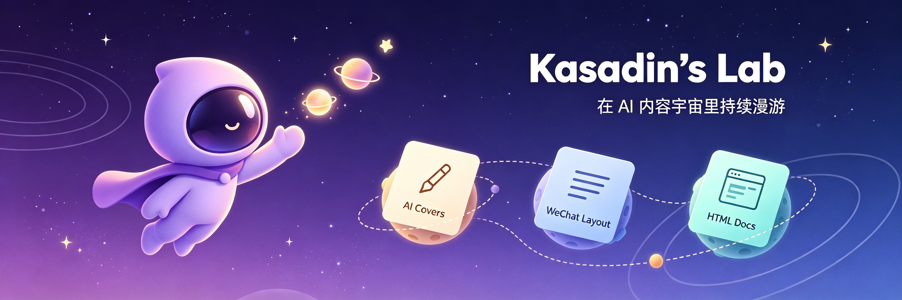

<div align="center">



<a href="https://github.com/willson-wen">
  
</a>

<p>
  <a href="https://wilson-portfolio-rouge.vercel.app"></a>
  <a href="https://evtol-platform.vercel.app"></a>
  
</p>

</div>

## 关于我

```ts
const wilson = {
  basedIn: "Shenzhen, China",
  focus: "AI 内容生产工具 / Agent Skills",
  mission: "把内容创作里重复的手工活，逐个封装成可复用的 Skill",
  stack: ["TypeScript", "Python", "HTML/CSS", "Browser Automation"],
  openSource: true,
  openToCollab: true,
};
```

## Kasadin · 中文 AI 内容生产流水线

> 一套按真实创作流程排列的 Skills：从视觉封面、文章配图，到公众号排版与单页分享文档，全链路提效。

| 流水线阶段 | Skill | 解决什么问题 |
|---|---|---|
| ① 视觉封面 | [kasadin-ai-covers](https://github.com/willson-wen/kasadin-ai-covers) | 高冲击力 3:4 中文 AI 内容封面 |
| ② 文章配图 | [kasadin-ai-illustrations](https://github.com/willson-wen/kasadin-ai-illustrations) | 16:9 中文 AI 文章插画 |
| ③ 公众号排版 | [kasadin-wechat-layout-skills](https://github.com/willson-wen/kasadin-wechat-layout-skills) | 浅橙石墨主题，生成可直接粘贴的排版 HTML |
| ④ 分享文档 | [kasadin-html](https://github.com/willson-wen/kasadin-html) | 粉雾蓝拟真 UI 单页 HTML，2-3 屏完成成稿 |

### 流水线之外的效率工具

- [ecom-image-to-prompt](https://github.com/willson-wen/ecom-image-to-prompt) · 从电商商品图反向提取生成提示词
- [boss-jd-scraper](https://github.com/willson-wen/boss-jd-scraper) · 登录态安全采集职位 JD：断点续采、风控停机规则、Excel 导出

## 其他项目

- [wilson-portfolio](https://github.com/willson-wen/wilson-portfolio) · 个人作品集（[在线预览](https://wilson-portfolio-rouge.vercel.app)）
- [evtol-platform](https://github.com/willson-wen/evtol-platform) · eVTOL 低空经济平台（[在线预览](https://evtol-platform.vercel.app)）
- [personal-blog](https://github.com/willson-wen/personal-blog) · 个人博客

<div align="center">

### 贡献动态


<br/>


<br/>
<br/>

<picture>
  <source media="(prefers-color-scheme: dark)" srcset="https://raw.githubusercontent.com/willson-wen/willson-wen/output/github-contribution-grid-snake-dark.svg" />
  <source media="(prefers-color-scheme: light)" srcset="https://raw.githubusercontent.com/willson-wen/willson-wen/output/github-contribution-grid-snake.svg" />
  
</picture>

<br/>
<br/>

**Thanks for stopping by · 把重复的创作，交给 Skills 与自动化**

</div>
